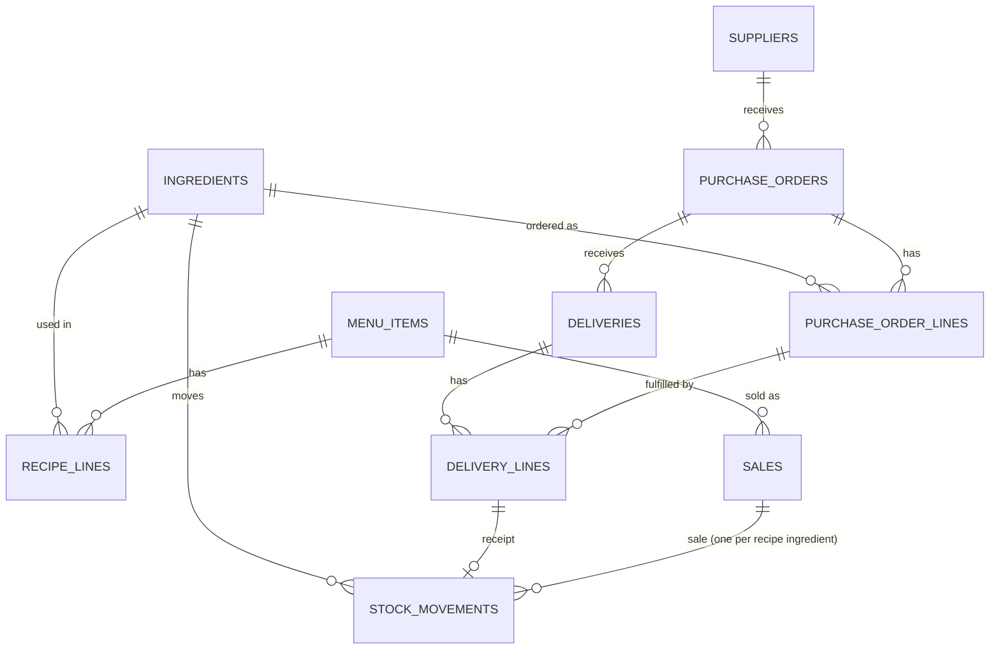

# Foodics Inventory & Purchasing — Burger Restaurant Demo

A single-restaurant inventory and purchasing system: ingredients, suppliers,
menu-item recipes, purchase orders with partial/idempotent receiving, and
POS sale events that deduct stock by recipe.

## 1. Purpose and implemented scope

Implements, end to end (API + web UI + tests), every capability the brief
requires:

1. Create/list ingredients (name + unit) and suppliers.
2. Define and view menu items and their ingredient recipes.
3. Create purchase orders (one supplier, 1+ distinct ingredient lines).
4. Enforce the `draft → sent → received → closed` order lifecycle.
5. Record full or partial, **idempotent** deliveries against orders.
6. Increase stock by exactly what an accepted delivery records.
7. Accept **idempotent** POS sale events (menu item + quantity).
8. Decrease stock by recipe quantity × quantity sold.
9. Show current stock and open orders with outstanding quantities, with
   visible freshness (last-updated time, polling, stale/error states).
10. Drive all of the above from a web UI, including a POS sale simulator
    that calls the real `/sales` endpoint.

Deliberately **not** implemented (per brief section 1 — out of scope for
this submission): authentication, deployment, payments/pricing/invoicing,
forecasting, real supplier emails, unit conversions, multiple
restaurants/branches, or edit/delete of ingredients/suppliers/recipes/orders.
"Sending" an order is an internal status transition, not an actual email.

## 2. Tech stack and exact versions used

Chosen to match the implementation prompt's stack and verified by actually
running it (not assumed):

| Component | Version (as run) |
| --- | --- |
| PHP | 8.3.35 (CLI, in Docker) |
| Laravel Framework | 13.34.0 |
| Composer | 2.8.12 |
| PostgreSQL | 16.15 (both dev and test databases) |
| PHPUnit | 12.5.37 |
| Node.js | v24.21.0 (host, for the frontend toolchain only) |
| npm | 11.19.0 |
| Vue | 3.5.43 |
| vue-router | 4.6.4 |
| TypeScript | 5.9.3 |
| vue-tsc | 2.2.12 |
| Vite | 8.3.2 |
| @vitejs/plugin-vue | 6.0.9 (v6, not v5, specifically for Vite 8 compatibility) |
| Tailwind CSS | 4.3.3 |
| laravel-vite-plugin | 3.2.0 |
| Docker / Docker Compose | 29.8.1 / v5.5.1 |

Exact-decimal arithmetic uses PHP's built-in **BCMath** extension
(`ext-bcmath`, declared in `composer.json`), never floats.

No local PHP/Composer/PostgreSQL was available or installed on the host, so
the entire backend toolchain runs inside Docker (see `Dockerfile`,
`docker-compose.yml`). Node *is* available on the host, so the frontend
toolchain (`npm`) runs there directly; Laravel serves the built assets.

## 3. Quick start

All commands assume you are in the repository root. Nothing here requires
sudo or any local PHP/Composer/PostgreSQL install — only Docker and Node.

```bash
# 1. Environment files (defaults work as-is; .env.testing is already
#    committed since it contains no secrets and must match phpunit.xml).
cp .env.example .env
# Optional: set HOST_UID/HOST_GID in .env to your own `id -u`/`id -g` so
# files Docker writes (vendor/, caches) are owned by you, not root.

# 2. Build and start Postgres (dev + test) and the PHP app container.
docker compose up -d --build

# 3. Install PHP dependencies and generate an app key.
docker compose exec app composer install
docker compose exec app php artisan key:generate

# 4. Migrate the dev database and load deterministic demo data.
#    DESTRUCTIVE: migrate:fresh drops and recreates every table. Fine for a
#    fresh clone; do not run it again if you want to keep local demo data.
docker compose exec app php artisan migrate:fresh --seed --force

# 5. Migrate the *separate* test database (used only by PHPUnit).
docker compose exec -e APP_ENV=testing app php artisan migrate:fresh --force

# 6. Install frontend dependencies and build the SPA assets.
npm install
npm run build

# App is now at:
open http://localhost:8000
```

For frontend iteration with hot reload instead of a one-off build, run
`npm run dev` in a separate terminal (Laravel's `@vite()` directive detects
the dev server automatically); `php artisan serve` is not needed since the
`app` Docker container already runs it on port 8000.

### Running the backend tests

```bash
# Unit + Feature + Concurrency suites (93 tests) against the real
# postgres_test database — never SQLite (see section 8).
docker compose exec app php artisan test
```

### Frontend checks

```bash
npm run typecheck   # vue-tsc --noEmit
npm run build        # type-checks, then produces public/build/*
```

### Code style (PHP)

```bash
docker compose exec app ./vendor/bin/pint --test   # check only
docker compose exec app ./vendor/bin/pint            # auto-fix
```

## 4. Demo walkthrough

With the seeded data from step 4 above (see `database/seeders/DatabaseSeeder.php`
for the exact scenario — 2 purchase orders, one auto-closed and one left
partially received, plus a few recorded sales), open http://localhost:8000:

1. **Dashboard** (`/`) — current stock for all 5 seeded ingredients
   (including ones with zero stock movements), and the one still-open
   purchase order with its outstanding line quantities.
2. **Ingredients** / **Suppliers** (`/ingredients`, `/suppliers`) — add a
   new ingredient (e.g. "Pickles", unit `g`) or supplier; try the same name
   twice to see the duplicate-name rejection.
3. **Menu Items** (`/menu-items`) — create a new recipe with 2+ repeatable
   ingredient rows.
4. **Purchase Orders** (`/purchase-orders`) — create a new draft order,
   click **Send**, then **View** to open its detail page.
5. **Purchase order detail** (`/purchase-orders/{id}`) — enter a quantity
   less than outstanding for one line and click **Record delivery**: status
   becomes "Partially received", the line's outstanding figure updates, and
   the delivery appears in the history list below. Click **Record
   delivery** again with the exact same inputs within the same page load to
   see the idempotent-replay message (the UI reuses the same
   `Idempotency-Key` until the form is reset).
6. **POS Simulator** (`/pos`) — pick a menu item and quantity and click
   **Record sale**; the Dashboard's stock numbers update accordingly (watch
   the "below zero" badge appear if you sell enough to exhaust an
   ingredient — selling burgers against the seeded data will *not* go
   negative, since the demo stock levels were deliberately sized to stay
   positive).

I also manually drove this exact flow end-to-end in a real browser via
Cursor's browser-automation tooling against the live Docker backend
(ingredients → supplier → recipe → PO → send → partial receive → dashboard
reflecting it → POS sale deducting recipe quantities → dashboard showing the
resulting negative-stock warning) — see section 10 for what that covered and
section 12 for the honest caveat about what it is *not* (an automated test).

## 5. Data model



- **`stock_movements`** is an append-only ledger, not a mutable balance:
  `stock(ingredient) = SUM(signed quantity)` over all its movements. Every
  row carries an unambiguous source — exactly one of `delivery_line_id` or
  `sale_id` is set (DB `CHECK` constraint), never both, never neither.
- **`purchase_order_lines.quantity_ordered`** never changes after creation.
  `outstanding(line) = quantity_ordered − SUM(delivery_lines.quantity_received for that line)`,
  computed from source rows every time, never cached.
- All quantity columns are `NUMERIC(18,3)` (exact decimal, 3 fractional
  digits) — see section 7 for why.
- Every table that represents accepted business history (`deliveries`,
  `delivery_lines`, `sales`, `stock_movements`) is **immutable through
  application code**: there are no update/delete endpoints for them.
- Case-insensitive unique indexes (`lower(name)`) back the duplicate-name
  policy for `ingredients`/`suppliers`/`menu_items` as real DB constraints,
  not just request validation.
- Full column/constraint detail is in `database/migrations/`, one file per
  table, each migration commented with *why* the constraint exists.

## 6. API reference

Base path: `/api/v1`. All responses are JSON. List/single-resource success
responses are wrapped as `{"data": ...}` (Laravel's default `JsonResource`
wrapping); `/dashboard` and `/stock` use their own explicit top-level keys
documented below.

| Method | Route | Purpose |
| --- | --- | --- |
| GET/POST | `/ingredients` | List / create ingredients |
| GET/POST | `/suppliers` | List / create suppliers |
| GET/POST | `/menu-items` | List / create menu items with recipes |
| GET/POST | `/purchase-orders` | List (`?status=open\|draft\|sent\|received\|closed`) / create orders |
| GET | `/purchase-orders/{id}` | Lines, cumulative receiving, outstanding, delivery history |
| POST | `/purchase-orders/{id}/send` | Draft → sent (no-op if already sent) |
| POST | `/purchase-orders/{id}/deliveries` | Idempotent receiving (requires `Idempotency-Key` header) |
| POST | `/sales` | Idempotent POS sale event |
| GET | `/stock` | Every ingredient's current balance, including zero-movement ones |
| GET | `/dashboard` | One consistent stock + open-orders snapshot + `generated_at` |

### Quantity representation

Every quantity is a **decimal string** with up to 3 fractional digits, both
in requests and responses (e.g. `"150.000"`, `"0.125"`, `"4000"` accepted on
input and normalized to `"4000.000"` in storage/output). Never a JSON
number. Backed end-to-end by the `App\Domain\Shared\Quantity` BCMath value
object (`app/Domain/Shared/Quantity.php`) — see section 7.

### Example: create a purchase order

```http
POST /api/v1/purchase-orders
Content-Type: application/json

{
  "supplier_id": 1,
  "lines": [
    { "ingredient_id": 1, "quantity": "10000" },
    { "ingredient_id": 2, "quantity": "40" }
  ]
}
```

```json
201 Created
{
  "data": {
    "id": 1,
    "status": "draft",
    "status_label": "Draft (not yet sent)",
    "supplier_id": 1,
    "sent_at": null,
    "closed_at": null,
    "created_at": "2026-10-02T19:00:00.000000Z",
    "lines": [
      { "id": 1, "ingredient_id": 1, "ingredient_name": "Beef Patty", "unit": "g",
        "quantity_ordered": "10000.000", "quantity_received": "0.000", "quantity_outstanding": "10000.000" },
      { "id": 2, "ingredient_id": 2, "ingredient_name": "Burger Bun", "unit": "piece",
        "quantity_ordered": "40.000", "quantity_received": "0.000", "quantity_outstanding": "40.000" }
    ],
    "deliveries": []
  }
}
```

### Example: idempotent delivery (receiving)

```http
POST /api/v1/purchase-orders/1/deliveries
Idempotency-Key: 6f1b3b2a-6c3b-4e7a-8c2f-6b2e6a9b2b3b
Content-Type: application/json

{
  "lines": [
    { "purchase_order_line_id": 1, "quantity": "4000.000" },
    { "purchase_order_line_id": 2, "quantity": "20.000" }
  ]
}
```

- First call: `201 Created`, `"replayed": false`.
- Identical retry with the **same** `Idempotency-Key` and an equivalent
  payload: `200 OK`, `"replayed": true`, same delivery, **no new stock
  movements** — "equivalent" means decimal strings are canonicalized first
  (`"20"` ≡ `"20.000"`) and lines are compared regardless of order.
- Same key, a genuinely **different** payload: `409 IDEMPOTENCY_CONFLICT`.
- A request that would exceed any line's outstanding quantity: `409
  OVER_RECEIPT` — the *whole* delivery is rejected, nothing is partially
  applied, even if other lines in the same request were valid.

### Example: idempotent sale

```http
POST /api/v1/sales
Content-Type: application/json

{
  "event_id": "be446e18-a222-4baa-8d34-2b859fd7f375",
  "menu_item_id": 1,
  "quantity": 3
}
```

Same `event_id` + equivalent payload (same `menu_item_id`/`quantity`) →
`200 OK`, `"replayed": true`, no new deductions. Same `event_id` + a
*different* `menu_item_id`/`quantity` → `409 IDEMPOTENCY_CONFLICT`.

### Error envelope

Every non-2xx response is:

```json
{ "error": { "code": "OVER_RECEIPT", "message": "...", "fields": { "lines": ["..."] } } }
```

`fields` is only present when there is a field-scoped detail. Error codes
in use:

| Code | HTTP | Meaning |
| --- | --- | --- |
| `VALIDATION_FAILED` | 422 | Laravel request-validation failure (shape/type/missing) |
| `NOT_FOUND` | 404 | Referenced resource (order, menu item, ...) does not exist |
| `INVALID_QUANTITY` | 422 | Malformed decimal, non-positive where positive required, or over the 1,000,000 per-line bound |
| `DUPLICATE_NAME` | 422 | Case-insensitive duplicate ingredient/supplier/menu-item name |
| `EMPTY_RECIPE` | 422 | Sale requested for a menu item with no recipe lines |
| `LINE_NOT_IN_ORDER` | 422 | A delivery line's `purchase_order_line_id` doesn't belong to the target order |
| `INVALID_ORDER_STATE` | 409 | Action (send/receive) not allowed in the order's current status |
| `OVER_RECEIPT` | 409 | A delivery line would exceed its outstanding quantity |
| `IDEMPOTENCY_CONFLICT` | 409 | Same idempotency identity reused with a different payload |

Stack traces are never exposed; the handler (`bootstrap/app.php`) renders
every domain exception, validation failure, and not-found through this one
envelope for all `/api/*` requests.

## 7. Business rules and assumptions

Points the brief leaves open, decided and documented here (as required):

- **Duplicate-name policy**: ingredient/supplier/menu-item identity is the
  database ID, never the name. An exact, case-insensitive duplicate name is
  rejected at creation (`DUPLICATE_NAME`, 422) rather than silently
  creating a second, confusing catalog entry. Enforced by a real unique
  index (`lower(name)`), not just request validation.
- **Negative stock**: `/sales` always records the full deduction, even
  into negative stock, because it represents a POS sale that already
  happened at the till — clamping to zero or silently skipping a deduction
  would hide a real discrepancy rather than surface it. The dashboard and
  stock listing show negative balances prominently (red, with a count
  badge and a ⚠ marker), never clamp them to zero. A pre-sale availability
  check is deliberately out of scope and can be added later as its own,
  explicit policy (see section 9).
- **Over-receiving**: rejected for the *whole* delivery (never clamped,
  never partially applied) if *any* line would exceed its outstanding
  quantity — `OVER_RECEIPT`, 409.
- **Precision**: all quantities are `NUMERIC(18,3)` / 3 decimal places,
  parsed and compared via the `Quantity` BCMath value object. Input is
  rejected (never rounded) if it has more than 3 decimal places, is
  non-finite, uses scientific notation, or exceeds 1,000,000 canonical
  units per line.
- **Initial stock**: every ingredient starts at exactly zero. The only way
  to establish stock is a real accepted delivery against a real purchase
  order — there is no "set initial stock" backdoor, by design.
- **Open-order definition**: every status except `closed` (i.e. `draft`,
  `sent`, `received`) counts as "open" for the `?status=open` filter and
  the dashboard's "open purchase orders" list. Drafts are shown with an
  explicit "Draft (not yet sent)" label so they are never mistaken for
  "sent".
- **Order-state interpretation**: `received` means "partially received,
  something still outstanding", not "every line done" — the latter is
  `closed`. A full first delivery can jump straight from `sent` to
  `closed` atomically (no transient `received` row is written).

## 8. Transactions, locking, and freshness (plain language)

- **Transaction boundaries**: every multi-row business write — creating an
  order with its lines, creating a menu item with its recipe lines,
  recording a delivery (header + lines + stock movements + order status),
  recording a sale (sale row + all its deductions) — happens inside one
  `DB::transaction()`. If anything inside fails, the whole thing rolls
  back; nothing is left half-written. This is verified by two dedicated
  tests that force a failure partway through a sale/delivery via a
  test-only event-listener seam and assert zero rows were left behind
  (`tests/Feature/ReceivingTest.php::test_a_controlled_failure_mid_delivery_rolls_back_every_write`,
  and the equivalent in `SaleTest.php`).
- **Receiving concurrency**: `ReceiveDelivery` takes a single
  `lockForUpdate()` on the *parent* `purchase_orders` row before reading
  anything else. Because every outstanding-quantity check and every write
  for that order only happens after the lock is held, two concurrent
  deliveries against the same order are fully serialized by PostgreSQL: the
  first to acquire the lock commits, and the second re-reads outstanding
  quantities *after* that commit and is correctly accepted or rejected
  against up-to-date numbers. No per-line locks are needed. Proven under
  genuine OS-process-level concurrency (not just within one PHPUnit call
  stack) in `tests/Concurrency/ConcurrentReceivingTest.php`, which
  reproduces the brief's exact acceptance case: 6 outstanding, two
  concurrent requests for 4 each, exactly one succeeds, total accepted
  stays 4.
- **Idempotent sales**: there is no natural "parent row" to lock for a
  sale, so duplicate concurrent requests are resolved via a database unique
  constraint on `sales.event_id` plus a catch-and-requery pattern: if two
  requests race to insert the same `event_id`, Postgres accepts one and
  rejects the other with a unique-violation error; the loser's code catches
  that specific error, lets Laravel finish rolling back its own aborted
  transaction, and only *then* re-queries (querying inside an aborted
  Postgres transaction is itself an error) to return the winner's result.
  Proven under real concurrency in `ConcurrentSaleIdempotencyTest`.
- **Idempotent deliveries**: same shape, but scoped to
  `(purchase_order_id, idempotency_key)`. Checked for a replay *before* any
  status/outstanding-quantity rule is applied, specifically so that
  replaying the delivery that just closed an order still succeeds even
  though the order is now `closed` (`ReceivingTest::test_replaying_the_delivery_that_closed_the_order_succeeds`).
  Payload equivalence for both idempotency kinds is based on a canonical
  hash: quantities are normalized through `Quantity` first (so `"20"` and
  `"20.000"` hash identically) and delivery lines are sorted by their
  stable `purchase_order_line_id` before hashing (so reordering the same
  lines doesn't look like a different request).
- **Dashboard freshness**: `/dashboard` wraps its stock + open-orders reads
  in one transaction and sets `SET TRANSACTION ISOLATION LEVEL REPEATABLE
  READ READ ONLY` as its first statement, so both reads see one consistent
  snapshot instead of two independent reads that could straddle an
  in-flight write. The returned `generated_at` timestamp documents *when*
  that snapshot was taken — it is not a promise of continuous real-time
  freshness; the UI's polling (next section) is what keeps the picture
  "recent".

## 9. Frontend architecture and the freshness contract

Vue 3 + TypeScript SPA (`resources/js`), served by Laravel from one Blade
shell (`resources/views/app.blade.php`) with Vue Router doing all
client-side routing (`routes/web.php` serves that shell for every
non-`/api` path, so a page refresh on `/purchase-orders/3` still works).

- `api/client.ts` — a thin typed `fetch` wrapper that parses the
  `{error:{code,message,fields}}` envelope into an `ApiRequestError`.
  Quantities are kept as **strings** everywhere in `types.ts`/the API layer
  — never parsed into a JS `number` for arithmetic — so the frontend cannot
  reintroduce the float-precision problem the backend's `Quantity` object
  exists to avoid; the UI only ever displays what the server computed.
- `composables/usePolling.ts` implements the brief's freshness contract in
  one place, used by the Dashboard and the PO detail page: fetch on mount;
  poll every 5s while the tab is visible; refetch immediately when the tab
  regains focus; expose `refresh()` for callers to invoke right after an
  accepted mutation (including a *replayed* one). Every call to `refresh()`
  aborts whatever request preceded it before issuing a new one, so **at
  most one request is ever in flight** and a slow, superseded response can
  never silently overwrite data from a newer refresh. Timers and the
  `visibilitychange` listener are torn down in `onUnmounted`. The failure
  path keeps the last known data and surfaces an inline error banner
  instead of blanking the screen; the last-updated timestamp only advances
  on a *successful* refresh.
- `composables/useIdempotencyKey.ts` — one UUID per submission intent,
  reused across retries of the *same* click (`rotate()` is only called
  after a successful submit, in `PurchaseOrderDetailPage.vue` and
  `PosSimulatorPage.vue`), so a flaky-network retry of a failed submission
  stays idempotent with itself instead of minting a new identity every
  time the user clicks.
- Every create/action form disables its submit button while the request is
  pending (`submitting`/`sending`/`receiving` refs), to avoid accidental
  duplicate clicks — correctness itself still comes from server-side
  idempotency, this is just UX, per the brief's explicit instruction not
  to rely on it for correctness.
- All business logic — recipe consumption math, outstanding-quantity math,
  idempotency resolution — lives in the backend. The frontend never
  computes or asserts a stock/outstanding number itself; it only renders
  what `/api/v1/*` returned.

## 10. Testing — what ran and the results

```
docker compose exec app php artisan test
# Tests:    93 passed (321 assertions)
```

- `tests/Unit` — `Quantity` parsing/arithmetic/bounds (incl. rejecting
  scientific notation, >3 decimals, non-finite input) and the
  `PurchaseOrderStatus` transition rules.
- `tests/Feature` — business-rule coverage against the real
  `postgres_test` database (never SQLite — see the comment in
  `phpunit.xml`), mapped to essential-coverage items 1–18 and 22 from the
  implementation prompt: ingredient/supplier/recipe/order validation,
  send/receive state transitions (first partial receipt, accumulation,
  one-line-done-doesn't-close-a-multi-line-order, full-first-delivery
  jumps straight to closed), over-receiving/cross-order/duplicate-line
  rejection with no partial effect, sale consumption correctness, sales
  not touching PO fulfillment, shared-ingredient stock aggregation,
  idempotent-replay (sale, delivery, decimal-canonicalized, reordered
  lines, replay-after-closure), and a forced-mid-write rollback test for
  both sale and delivery.
- `tests/Concurrency` — items 19–21, run against a `php artisan serve`
  subprocess spawned with its own OS process/DB connections (not just
  PHPUnit's call stack), using Laravel's `Http::pool()` to fire genuinely
  concurrent requests:
  - the brief's exact acceptance case: 6 outstanding, two concurrent
    requests for 4 each → one `201`, one `409`, total accepted stays 4;
  - two concurrent identical deliveries (same `Idempotency-Key`) → exactly
    one `Delivery` row;
  - two concurrent identical sales (same `event_id`) → exactly one `Sale`
    and one `StockMovement`;
  - ten concurrent *distinct* sales → all 10 succeed, total stock
    deduction sums correctly with no lost updates.

```
npm run typecheck   # vue-tsc --noEmit — passes, no errors
npm run build        # vue-tsc --noEmit && vite build — passes, 14 chunks emitted
```

**Browser verification**: no automated browser/E2E test file was written —
being explicit about this rather than implying otherwise. What I *did* do
is drive the complete manager workflow manually, interactively, in a real
Chromium tab against the live Docker backend via Cursor's browser-tool
integration: created 3 ingredients and a supplier, created a 2-line recipe,
created+sent a purchase order, recorded a partial delivery (watched the
line's outstanding figure and the order's status label update, and the
delivery appear in history), confirmed the dashboard reflected the new
stock and the still-open order, recorded a POS sale and watched Beef Patty
stock decrease by exactly `200.000 g` and Burger Bun stock go to `-1.000`
with the dashboard's negative-stock badge appearing, and triggered + saw
the inline duplicate-name error message render correctly. This covers the
polling/freshness and failure-feedback requirements by direct observation,
not by an automated assertion — a genuine gap, called out again in section
12.

Formatting: Laravel's default `laravel/pint` dependency was already present
from scaffolding; `./vendor/bin/pint --test` found 10 style issues (mostly
`single_line_empty_body`, import ordering, unary-operator spacing) across
10 files, fixed by running `./vendor/bin/pint` (no `--test` flag), then the
full 93-test suite was re-run to confirm the formatting pass changed no
behavior. No separate frontend linter (e.g. ESLint) is configured —
`vue-tsc`'s type-check is the only automated frontend check. Neither is
wired into a CI step in this repository (there is no CI here at all), so
re-running `./vendor/bin/pint --test` and `npm run typecheck` before every
commit is a manual habit, not an enforced gate — listed as a limitation in
section 13, not glossed over.

## 11. Extension points (not built now, but located)

- **Stock adjustment/wastage**: a new `AdjustStock` action creating a
  `stock_movements` row with a new `type` value (e.g. `'adjustment'`) and
  an explicit `reason`/`source` column; existing receipt/sale rows stay
  untouched.
- **Refunds/voids**: a new `sale_reversals` table (or a `type` on
  `stock_movements`) linked back to the original `sale_id`, applied as a
  *new*, explicitly-linked positive movement — never a negative `quantity`
  on `sales` or a delete.
- **Recipe editing**: add `recipe_lines.effective_from`/versioning (or a
  recipe-snapshot copy taken at sale time); `RecordSale` already snapshots
  the deduction amount into `stock_movements` at sale time, so historical
  sales are already insulated from future recipe edits — only *creating*
  new recipe versions needs to be added.
- **PO cancellation**: a new `cancelled` status plus a decision (document
  it when built) on whether already-received lines on a cancelled order
  stay in stock (yes, almost certainly — the lines were legitimately
  received) — add to `PurchaseOrderStatus::canBeSent()`-style methods.
- **Unit conversion**: introduce a conversion table/service at the
  `Quantity`/ingredient boundary (e.g. a `UnitConverter` consulted only
  where a line's unit differs from the ingredient's canonical unit);
  deliberately not threaded through every controller today.
- **Multi-restaurant/branch**: add a `location_id` (or `tenant_id`) foreign
  key to every business table and scope every query by it; this is a real
  migration + global-scope change, not a header flag — see `PLAN.md` for
  how this is sequenced as an actual release.
- **Push updates / cached balances**: replace `usePolling`'s interval with
  a WebSocket/SSE push *in the same composable interface* (same `data`,
  `loading`, `error`, `lastUpdated` shape); the transactional source
  (`stock_movements`, `purchase_order_lines`) does not change, only how the
  read side is refreshed.

## 12. Actual AI usage

This project was built with Cursor using Claude Sonnet 5 as the primary
coding agent. The two main prompts driving implementation were (a) the
attached `Build_Challenge___Engineering_Manager__ERP.pdf` (Foodics' brief,
authoritative for scope) and (b) `Claude_Implementation_Prompt.md` in this
repository (a detailed implementation prompt supplying stack choices and
business-rule detail for points the brief left open — explicitly one of
the "main prompts" per its own instructions, and the source of most of the
specific requirement language quoted throughout this README).

Useful output: the AI produced the full domain layer (`Quantity` value
object, enums, Actions, exceptions), migrations with real DB constraints,
the API layer, the full Vue/TS frontend, and the PHPUnit suite (93 tests)
largely correctly on the first pass against the detailed prompt — the
prompt's own precision (exact business rules, exact concurrency
discipline, exact idempotency semantics) did most of the work of avoiding
mistakes in that code.

**Specific mistakes actually found and corrected, with verification:**

1. **Container-level env vars silently defeating the test database
   override.** `docker-compose.yml`'s `app` service originally set
   `DB_HOST`/`DB_PORT` directly in its `environment:` block. Docker
   container-level environment variables take precedence over *both*
   Laravel's `.env`/`.env.testing` file loading (`vlucas/phpdotenv` skips
   keys already present in the process environment) *and* PHPUnit's
   `<env>` directives in `phpunit.xml` *unless* those carry
   `force="true"`. Since `DB_DATABASE` was not set at the container level
   but `DB_HOST` was, every "testing" run was silently connecting to
   `foodics_test` on the **dev** `postgres` container (which had
   incidentally grown a same-named database) instead of the real
   `postgres_test` container — so 55 Feature tests had been reported
   "passing" against the wrong database. This was only caught because the
   newly-added Concurrency suite's spawned subprocess exposed inconsistent
   `relation "suppliers" does not exist` errors; I wrote a temporary
   diagnostic test that printed `config('database.connections.pgsql.host')`
   from *inside* an actual test run (not a separate `artisan` call) to
   confirm the mismatch, then inspected both Postgres containers directly
   via `psql` to confirm `postgres_test` was genuinely empty while
   `postgres` had an unexpected `foodics_test` database on it. Fixed by
   removing the container-level `DB_HOST`/`DB_PORT` override (now sourced
   only from `.env`/`.env.testing`, as intended) and adding `force="true"`
   to every `DB_*` entry in `phpunit.xml` as defense in depth. **Verified**
   by dropping the stray database, re-migrating the real `postgres_test`,
   and re-running the entire Unit+Feature suite (89 tests) and the new
   Concurrency suite (4 tests) from a clean state — all 93 passed against
   the now-confirmed-correct database.
2. **`Fatal error: Cannot redeclare errorResponse()`** on the second test
   in any PHPUnit run. A plain `function errorResponse(...)` had been
   declared at file scope in `bootstrap/app.php`; Laravel's test harness
   `require`s (not `require_once`s) that file once per test via
   `refreshApplication()`, so a bare function declared there is
   redeclared on the second test and fatals. Fixed by moving the logic
   into an autoloaded class, `App\Http\ApiError::response()`, which
   Composer's autoloader only loads once regardless of how many times
   `bootstrap/app.php` itself is required. **Verified** by re-running the
   suite past the second test (it previously fataled immediately after the
   first).
3. **`SET TRANSACTION ISOLATION LEVEL` 25001 error** on `GET /dashboard`
   under `RefreshDatabase`-wrapped tests. PostgreSQL only allows that
   statement as the literal first statement of a *new* top-level
   transaction, but `RefreshDatabase` already has one open, so
   `DashboardQuery`'s own `DB::transaction()` only opened a nested
   savepoint (`DB::transactionLevel() > 1`), and the isolation-level
   statement failed. Fixed by guarding it with
   `if (DB::transactionLevel() === 1)` — correct and necessary in
   production (a fresh request has no outer transaction) while skipping it
   safely in tests. **Verified**: the Feature test for the dashboard route
   passes, and the guard's production correctness was reasoned through
   rather than left unverified (there is no automated test that opens two
   literal top-level Postgres connections to prove `REPEATABLE READ READ
   ONLY` actually produces a consistent snapshot under a concurrent write —
   a genuine, stated limitation, not a hidden gap).

I did not observe any other mistake rising to "substantive" during this
build — no fabricated test results, no invented timings, no claims this
section omits.

## 13. Honest limitations and valuable next steps

- **No automated browser/E2E test.** Section 10 explains exactly what was
  manually verified instead and why that is not equivalent evidence. The
  single most valuable next addition would be one Playwright test covering
  the create → send → partial-receive → sale → dashboard-reflects-it path.
- **No CI pipeline.** `laravel/pint` (PHP) and `vue-tsc` (TypeScript) both
  ran clean locally (section 10), but nothing enforces them automatically
  on every push — a real next step is a GitHub Actions workflow running
  `php artisan test`, `./vendor/bin/pint --test`, and `npm run build`.
- **The dashboard's snapshot-consistency claim (`REPEATABLE READ READ
  ONLY`) is reasoned through, not independently proven** by a concurrent
  test that opens two real connections and interleaves a write between the
  dashboard's two reads. Worth a dedicated test if this becomes
  safety-critical.
- **No rate limiting / abuse protection** on any endpoint — fine for a
  local demo, not production-ready.
- **Supplier/ingredient/menu-item editing and deletion are intentionally
  absent**, per the brief's explicit scope — a real product will need at
  least a soft-delete/deactivate story once referenced by order/recipe
  history that must never be rewritten.
- **Single branch, single currency, single unit per ingredient** — see
  `PLAN.md` for how multi-restaurant scoping is sequenced as a real,
  separate migration rather than retrofitted here.
- **No background job/queue usage anywhere** — intentional (the brief asks
  for synchronous, transactionally-consistent writes, not async
  "eventually visible" stock), but worth stating since it means a very
  large batch of concurrent sales will be bounded by direct DB connection
  concurrency rather than a queue's backpressure.
